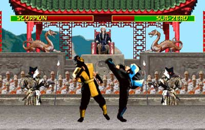

Beat 'em up!
========

This project by [Simon Sablowski](http://www.simsab.net) is an HTML5 and JavaScript-based tribute to [Mortal Kombat](http://en.wikipedia.org/wiki/Mortal_Kombat),
a classic beat 'em up game developed by [NetherRealm Studios](http://www.netherrealm.com), formerly Midway Games Chicago.
All graphics, characters and related elements are taken from the original game, trademarks and property of Warner Bros. Entertainment Inc. WB SHIELD ™ &amp; Warner Bros. Entertainment Inc.(s10).



Demo: [simonsablowski.github.io/beatemup](https://simonsablowski.github.io/beatemup/)

## Controls

Press any key to start a fight. Use the arrow keys to move, the space bar to punch and enter to kick.

## Development

The game runs directly in the browser from the files in this repository, without a build step.
Because it uses JavaScript modules, it has to be served over HTTP rather than opened from disk.

```sh
npm install
npm start      # serves the game at http://localhost:8080
npm test       # runs the tests
npm run lint   # checks the code
```

Pushing to `master` publishes the game on GitHub Pages.

### Project structure

```
index.html              page that loads src/main.js
css/style.css           page styles
assets/images/          shared images (arena, energy bar, banners)
assets/sounds/          shared sound effects
assets/characters/<id>/ sprite sheet, name, victory banner and sound per character
src/main.js             loads the assets and starts the game
src/config.js           gameplay settings, timing, key bindings and HUD layout
src/assets.js           paths of the shared assets
src/engine/             asset loading, game loop and canvas drawing
src/game/               game stages (title, fight, rematch) and HUD
src/fighters/           fighter state machine, moves and hit detection
src/characters/         character data: assets and sprite sheet animations
src/input/              keyboard and computer-controlled input
test/                   unit tests
```

Every frame, the game loop draws the scene; ten times per second it reads each fighter's input,
advances the fighters and resolves hits. Keyboard and computer input both produce the same intent
(`left`, `right`, `punch`, `kick`), so either can control any fighter.

### Adding a character

1. Add the sprite sheet, name, victory banner and victory sound to `assets/characters/<id>/`.
2. Describe the character in `src/characters/<id>.js`, following `scorpion.js`: the sprite sheet's
   frame size, the direction the character faces in it, and the frames of each animation.
3. Register it in `src/characters/index.js`.

### Naming conventions

Asset files and folders use kebab-case. JavaScript files are named after what they export:
PascalCase for classes (`Fighter.js`), camelCase otherwise (`combat.js`).
